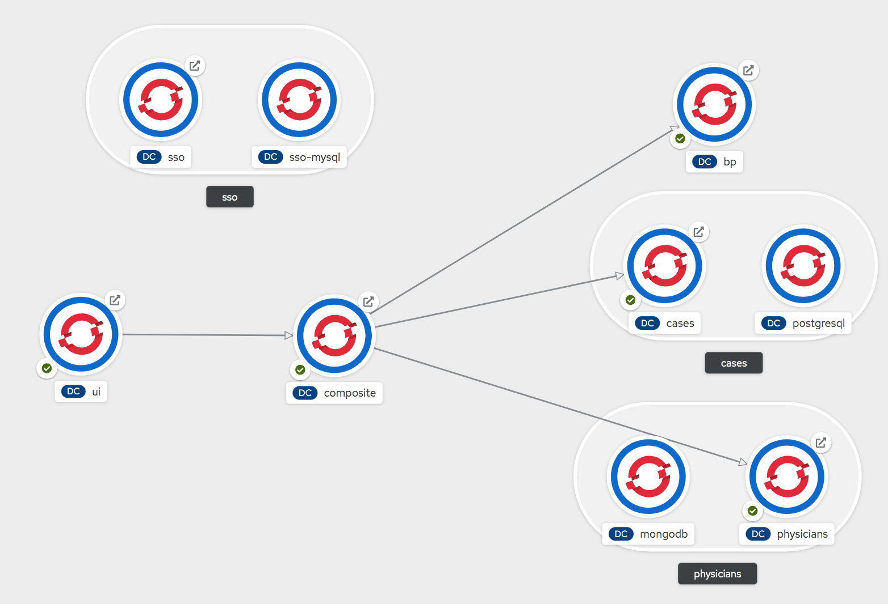

# quarkus-hackathon
Microservices baded Medical case submission portal
# components

1 - Physicians: physician profile service connecting to Mongodb 

2 - Cases: case request service connecting to Postgresql

3 - bp: kogito based business process service

4 - Composite: a simple composite service using proxy and microgateway design patterns

5 - UI: AngularJS using quarkus qute templating engine

6 - Red Hat Single Sign-On (RHSSO)

Below opensource technologies are used 

mapbox : https://www.mapbox.com/community/

JS bpmn viewer: https://bpmn.io/

# Screenshots
Login

Search physicians by specialities

Search nearby physicians by specialities

Submit case 

Review your cases 

